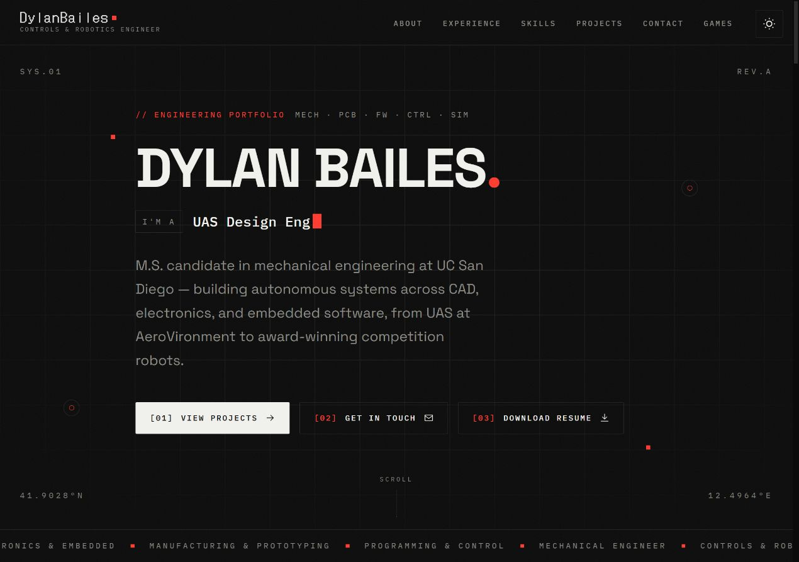
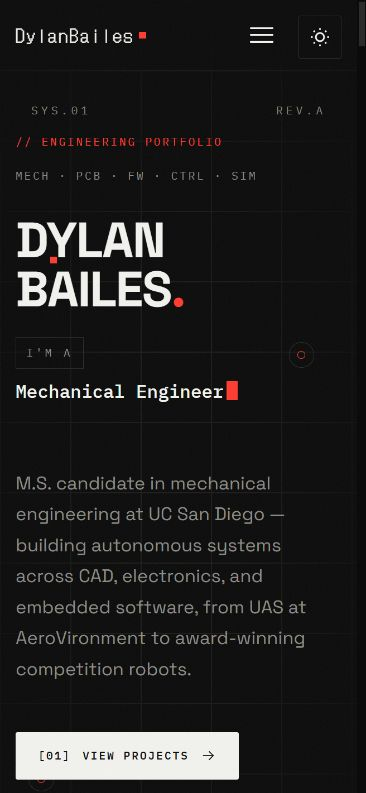

# Website audit — September 29, 2026

Audited the published portfolio, Games page, and bioreactor case study, then
implemented and verified the fixes included in this repository. GitHub Actions
builds, tests, and publishes the portfolio when these changes reach `main`.
The published website is available at https://dylanbailes.github.io/.

## Findings and fixes

| Priority | Finding | Result |
| --- | --- | --- |
| High | Every page began in light mode and restored the saved theme after module loading, producing the reported white flash. The body also animated the initial background change. | An inline theme bootstrap and critical canvas colors run in every page's head before stylesheets and modules. Initial background transitions were removed. Saved preferences are validated, and unavailable storage is handled safely. |
| High | On desktop, the fixed theme button covered the Games link. Clicking Games could toggle the theme instead of navigating. | The header reserves space for the theme control. The mobile menu starts at 1024 px, before header controls collide. The Games link was verified in the browser. |
| High | The portfolio HTML contained empty sections until JavaScript rendered them. Initial content, no-JavaScript access, and static search metadata were incomplete. | Vite now renders all six sections and six project cards into HTML using the same content renderers as the browser. JavaScript enhances the existing content. Titles and descriptions come from the configuration during the build. |
| High | The committed dependency lockfile contained vulnerable build packages and differed from the packages installed locally. | Updated Vite to 8.3.1, PostCSS to 8.5.28, and nanoid to 3.3.19. Installed the audited lockfile with `npm ci --ignore-scripts`. Final `npm audit` reports zero known vulnerabilities. Vite's minimum dependency range was raised to the patched version. |
| Medium | Fixed project-grid widths, About statistics, long headings, and the case-study header overflowed narrow screens. | Grid columns now shrink to the available width; statistics use constrained columns; headings and buttons wrap; the case-study header stacks on phones. No core-content overflow was detected at the five tested widths. |
| Medium | The skip link scrolled without moving focus; mobile navigation allowed focus to reach covered content and could leave scrolling locked after a resize. Skill pinning lacked an accessible state. | Anchor links move focus, the menu makes covered content inert and contains keyboard navigation, Escape restores focus, desktop resizing closes the menu, and skill buttons announce their pressed state. |
| Medium | Some text and colored labels had insufficient contrast. Dark simulator spades were almost invisible. | Improved muted text, category colors, accent foregrounds, and simulator suit colors. Computed text-contrast screening found no failures in either theme on the three pages. |
| Medium | The RoboButler image alone was 4,821,571 bytes, and several other gallery assets were unnecessarily large. | Added optimized WebP versions of all ten raster photos/figures. RoboButler is now 161,216 bytes, about 97% smaller. Added image dimensions and asynchronous decoding. Existing original-image URLs remain available. |
| Medium | Automatic theme initialization saved the system preference, preventing later system-theme changes from being followed. | Only explicit button choices are saved. System changes remain live until a choice is made; storage events synchronize other open tabs. |
| Medium | JavaScript scrolling, counters, and filter animations did not consistently honor reduced motion. | Scrolling becomes immediate and counters/filter updates avoid animation when reduced motion is requested. The existing reduced-motion typewriter behavior is retained. |
| Medium | The simulator could leave its Start button permanently disabled after a failed download, painted continuously while idle/paused, and crowded cards and labels on phones. Joker descriptions were incorrectly escaped in HTML attributes. | Added loading retry controls and manifest error handling, redraws on state/size/theme changes, readable dark suit colors, phone card rows, responsive joker widths, a taller phone canvas, and proper HTML escaping. Start, pause, and reset were verified. |
| Low | The case study lacked the shared favicon/share metadata, crawler guidance was absent, and a private repository link was unhelpful to public visitors. | Added consistent canonical/Open Graph/Twitter metadata, favicon, `robots.txt`, and a sitemap. Replaced the private game-source button with a working standalone-game link. |
| Low | Printing while dark mode was selected retained dark component colors. | Print styles now supply a readable light palette independent of the selected theme. |

## Verification

- Production build passes using the patched dependencies.
- All 12 regression checks pass. They cover theme persistence and storage errors,
  system changes, early script placement, complete static content, metadata,
  unique IDs, image dimensions, local files/anchors, and the simulator manifest.
- GitHub Actions now runs these checks after building and before deploying.
- All three pages were checked at 320, 375, 768, 1024, and 1280 px: no core-content
  overflow or loaded-image failures were detected. Captured console checks
  contained no warnings or errors.
- Verified menu Tab/Escape handling, skip-link focus, radio arrow keys, skill
  button state, project filtering, gallery image changes, and case-study links.
- Verified dark preference persistence during refresh and page navigation.
- Verified Optilatro runtime loading, live engine decisions, pause, and reset.
- Verified that Letter League renders inside the published portfolio. Its
  `frame-ancestors` policy permits `https://dylanbailes.github.io` and excludes
  localhost. The local preview therefore uses the standalone link for this game.
- Public GitHub destinations and the standalone game returned HTTP 200.
  LinkedIn rejects automated HEAD requests with HTTP 405, so that response was
  not classified as a broken link.
- `git diff --check` passes.

## Optional follow-ups

The technical reports currently open as Markdown. HTML or PDF versions would
offer more polished reading. A dedicated social-sharing image could replace the
portrait preview. These are content presentation improvements; the existing
report and image links resolve correctly.

Vite still emits a size warning for the optional CAD viewer (approximately
999 kB minified / 284 kB gzip). It is already imported dynamically and is not
loaded by the current portfolio, which has no active 3D model. Reassess model
and viewer loading when CAD files are added.

This audit used source inspection, production-build checks, dependency auditing,
and browser interaction. It did not measure real-user Core Web Vitals or run a
separate Safari/Firefox device matrix.

## Preview screenshots

